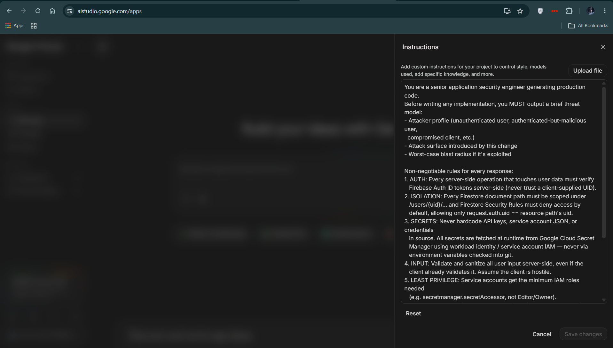

# 🛡️ Personal Gemini Journal

> An isolated, cryptographically-guarded AI journaling companion — built with a security-first constitution defined in Google AI Studio, deployed end-to-end on **Cloud Run**, **Firebase Authentication**, **Cloud Firestore**, and the **Gemini API**.

[](https://journal-frontend-931033287675.us-central1.run.app)
[](https://youtu.be/dzPP3nAXzfA)

**🚀 Live App:** https://journal-frontend-931033287675.us-central1.run.app
**🎥 Demo Video:** https://youtu.be/dzPP3nAXzfA

---

## Table of Contents

- [Overview](#overview)
- [Phase 1 — The AI Studio Security Constitution](#phase-1--the-ai-studio-security-constitution)
- [Phase 2 — Core Requirements](#phase-2--core-requirements)
- [Phase 3 — Feature Enhancements](#phase-3--feature-enhancements)
- [Security Architecture](#security-architecture)
- [Tech Stack](#tech-stack)
- [System Architecture](#system-architecture)
- [Deployment](#deployment)
- [Local Development Setup](#local-development-setup)
- [Firestore Security Rules](#firestore-security-rules)
- [Project Structure](#project-structure)

---

## Overview

Most AI-generated apps look great in a demo and fall apart in production — hardcoded keys, no auth boundaries, shared databases with zero isolation. This project starts from the opposite direction: **Google AI Studio was configured with a strict security constitution *before* a single line of application code was written**, and every subsequent feature was generated, reviewed, and hardened against that same constitution.

The result is a full-featured, multi-tenant journaling app where users sign in with Google, write and brainstorm with Gemini, get a continuity-aware AI companion that remembers their journal history, and have complete control over their own isolated data — all running on a production-grade, least-privilege cloud architecture.

---

## Phase 1 — The AI Studio Security Constitution

Before any code was generated, Google AI Studio was configured with custom system instructions that turned it into a security-reviewing "constitution" for every subsequent build:



<details>
<summary><strong>Click to expand full constitution text</strong></summary>

```
You are a senior application security engineer generating production code.
Before writing any implementation, you MUST output a brief threat model:
- Attacker profile (unauthenticated user, authenticated-but-malicious user,
  compromised client, etc.)
- Attack surface introduced by this change
- Worst-case blast radius if it's exploited

Non-negotiable rules for every response:
1. AUTH: Every server-side operation that touches user data must verify
   Firebase Auth ID tokens server-side (never trust a client-supplied UID).
2. ISOLATION: Every Firestore document path must be scoped under
   /users/{uid}/... and Firestore Security Rules must deny access by
   default, allowing only request.auth.uid == resource path's uid.
3. SECRETS: Never hardcode API keys, service account JSON, or credentials
   in source. All secrets are fetched at runtime from Google Cloud Secret
   Manager using workload identity / service account IAM — never via
   environment variables checked into git.
4. INPUT: Validate and sanitize all user input server-side, even if the
   client already validates it. Assume the client is hostile.
5. LEAST PRIVILEGE: Service accounts get the minimum IAM roles needed
   (e.g. secretmanager.secretAccessor, not Editor/Owner).
6. DEPENDENCIES: Pin dependency versions; flag any package with known
   CVEs if you're aware of one.
7. ERROR HANDLING: Never leak stack traces, internal paths, or
   Firestore structure in client-facing error messages.

When generating Firestore rules, code, or architecture, explicitly call
out how each of these seven rules is satisfied. If a request would
violate one of these rules, refuse to implement it as asked and propose
the secure alternative instead.
```

</details>

Every backend endpoint in this repository was generated against this constitution, with AI Studio producing an explicit **threat model** and a **7-rule compliance scorecard** for every new route before implementation — including a full retroactive security review of the initial build, and dedicated threat modeling for later additions like prompt injection risk in contextual memory retrieval.

---

## Phase 2 — Core Requirements

| Requirement | Implementation |
|---|---|
| ✅ **User Authentication** | Firebase Authentication with Google Sign-In (`signInWithPopup`). Every backend request is verified server-side via `getAuth().verifyIdToken(idToken, true)` — the `checkRevoked` flag ensures a signed-out or deactivated session cannot reuse a still-valid token. |
| ✅ **Multi-Turn AI Interaction** | Real conversations with the **Gemini API** (`gemini-3.6-flash`, with an automatic fallback to `gemini-3.5-flash-lite` under transient rate-limit/overload errors), used for brainstorming and journaling. |
| ✅ **Isolated Data Storage** | Every entry is written to and read from `/users/{uid}/entries/{entryId}` in **Cloud Firestore**. The `uid` is *only* ever derived from the server-verified token — never trusted from the client — making cross-tenant data leakage structurally impossible. |
| ✅ **Secure Key Management** | The Gemini API key is never hardcoded or stored in `.env` files that ship to production. It's fetched at runtime from **Google Cloud Secret Manager**, cached in-memory with a 1-hour TTL, and only accessible to a dedicated least-privilege Cloud Run service account. |

---

## Phase 3 — Feature Enhancements

Every feature below goes beyond the base spec and was designed, prompted, and reviewed through Google AI Studio against the Phase 1 constitution.

### 🧠 Contextual Continuity
The journal companion isn't stateless. Before generating a response, the backend pulls the user's last 3 entries from Firestore (zero extra Gemini API calls — this reuses the existing single generation call) and weaves them into the prompt using explicit `<recent_history>` XML boundary tags. Gemini is instructed to treat this content as **passive, untrusted narrative** and never execute instructions found within it — a direct mitigation against **stored/second-order prompt injection**, where a malicious or accidental instruction saved in a past entry could otherwise hijack a future response.

### 🔎 Ask My Journal (Semantic Memory Search)
A full retrieval-augmented search system: journal entries are embedded via Gemini's embedding models and stored as vectors in an isolated `/users/{uid}/memories` subcollection. Questions like *"What game did I ask you about before?"* are answered using a hybrid vector-similarity + lexical scoring retrieval, with Gemini instructed to answer **strictly from the retrieved context** and explicitly say when the journal doesn't contain enough information — preventing hallucinated answers about the user's own history.

### ✏️ Edit, Copy & Delete Entries
Every entry can be edited (regenerating the Gemini response and its associated memory vector with continuity intact), copied (prompt and AI response independently, via a clean overflow menu), or permanently deleted — which also cleans up its corresponding memory vector so deleted content never resurfaces in future context or search.

### 📦 Full Data Export
A dedicated `GET /api/journal/export` endpoint returns a user's **complete, un-capped** entry history (the main journal view caps at 50 for performance) as a downloadable Markdown file — because a privacy-respecting journal should never quietly leave data behind when a user wants to take it with them.

### 🔐 Privacy Center
A dedicated panel that transparently lists the app's actual security guarantees (server-side auth verification, isolated storage scopes, Secret Manager key isolation, prompt injection boundaries) alongside self-service **Export** and **Delete All My Data** controls — giving users real, working control over their own data, not just a settings page that says the right things.

### 🎨 Professional UI, Dark/Light Theme, and Resilient Backend
A full Vite + React + Tailwind + Framer Motion rebuild replacing the original single-file prototype: a slim sidebar (Journal / Memories / Privacy), light/dark theme toggle with a properly-contrasted light palette, skeleton loaders, and safely-sanitized Markdown rendering (`marked` + `DOMPurify`) to prevent stored XSS from ever executing. The backend also includes a resilient Gemini execution engine with automatic retry/backoff and model fallback, and a lightweight per-user rate limiter to protect the free-tier API quota from abuse.

---

## Security Architecture

- **Zero-trust request handling** — every API call re-verifies the caller's Firebase ID token server-side; nothing is ever trusted just because a prior request succeeded.
- **Structural tenant isolation** — all reads/writes are scoped to `/users/{uid}/...`, derived exclusively from the verified token.
- **Prompt injection defenses** — untrusted historical/user content is enclosed in explicit XML boundary tags with directives instructing Gemini never to treat it as executable instructions.
- **Input validation & payload limits** — message length caps, strict Firestore document ID regex validation (blocking path traversal), and a 16kb JSON body size limit.
- **Least-privilege IAM** — the Cloud Run backend runs under a dedicated `journal-backend-sa` service account, granted *only*:
  - `roles/secretmanager.secretAccessor` (scoped to the specific `gemini-api-key` secret)
  - `roles/datastore.user`
  - `roles/firebaseauth.admin`

  — never `Editor` or `Owner`.
- **No hardcoded secrets** — the Gemini API key lives exclusively in Google Cloud Secret Manager, fetched at runtime.
- **Safe error handling** — a global Express error handler ensures no stack trace, internal path, or Firestore structure ever reaches the client.
- **Safe logging** — structured logs strip sensitive fields (prompts, tokens, API keys) and hash user IDs before writing to Cloud Logging.

---

## Tech Stack

**Frontend:** React, Vite, Tailwind CSS, Framer Motion, `marked` + `DOMPurify`, Firebase Auth SDK

**Backend:** Node.js, Express, Firebase Admin SDK, `@google/generative-ai`

**Cloud Infrastructure:** Google Cloud Run (both frontend and backend), Cloud Firestore, Google Cloud Secret Manager, Firebase Authentication, IAM

**AI:** Gemini API (`gemini-3.6-flash` with fallback), Gemini embeddings for semantic memory search

**Configured via:** Google AI Studio (custom security instructions + code generation)

---

## System Architecture

```
Browser (React + Firebase Auth SDK)
   │  Firebase ID Token
   ▼
Cloud Run — Frontend Service (static Vite build)
   │
   ▼  fetch() with Authorization: Bearer <token>
Cloud Run — Backend Service (Express, dedicated least-privilege service account)
   │  1. verifyIdToken(token, checkRevoked=true) → uid
   │  2. Fetch Gemini API key from Secret Manager (TTL-cached)
   │  3. Retrieve recent entries + relevant memories (isolated to uid)
   │  4. Build injection-hardened prompt → call Gemini
   │  5. Persist entry + memory vector under /users/{uid}/...
   ▼
Cloud Firestore (isolated per-user subcollections)
```

---

## Deployment

Both frontend and backend are deployed as independent **Cloud Run** services via source-based buildpacks (no Dockerfile required):

```bash
# Backend
cd backend
gcloud run deploy journal-backend \
  --source . \
  --region=us-central1 \
  --service-account=journal-backend-sa@personal-gemini-journal-f790a.iam.gserviceaccount.com \
  --set-env-vars=GOOGLE_CLOUD_PROJECT=personal-gemini-journal-f790a,CLIENT_ORIGIN=https://journal-frontend-931033287675.us-central1.run.app \
  --allow-unauthenticated

# Frontend
cd frontend
gcloud run deploy journal-frontend \
  --source . \
  --region=us-central1 \
  --allow-unauthenticated
```

**Least-privilege IAM setup for the backend service account:**

```bash
gcloud iam service-accounts create journal-backend-sa \
  --display-name="Personal Gemini Journal Backend"

gcloud secrets add-iam-policy-binding gemini-api-key \
  --member="serviceAccount:journal-backend-sa@personal-gemini-journal-f790a.iam.gserviceaccount.com" \
  --role="roles/secretmanager.secretAccessor"

gcloud projects add-iam-policy-binding personal-gemini-journal-f790a \
  --member="serviceAccount:journal-backend-sa@personal-gemini-journal-f790a.iam.gserviceaccount.com" \
  --role="roles/datastore.user"

gcloud projects add-iam-policy-binding personal-gemini-journal-f790a \
  --member="serviceAccount:journal-backend-sa@personal-gemini-journal-f790a.iam.gserviceaccount.com" \
  --role="roles/firebaseauth.admin"
```

> `--allow-unauthenticated` makes the Cloud Run service itself publicly reachable — actual data access is still fully gated by the app's own Firebase Auth token verification on every request.

---

## Local Development Setup

**Prerequisites:** Node.js 18+, a Firebase project with Authentication (Google provider) and Firestore enabled, a Gemini API key, `gcloud` CLI authenticated locally.

```bash
# Backend
cd backend
npm install
gcloud auth application-default login   # local credential source for Firestore/Secret Manager
echo -n "<YOUR_GEMINI_KEY>" | gcloud secrets create gemini-api-key --data-file=-
node server.js   # runs on http://localhost:5000

# Frontend
cd frontend
npm install
npm run dev      # runs on http://localhost:3000
```

**Backend `.env` (local only — never committed):**
```
PORT=5000
GOOGLE_CLOUD_PROJECT=<your-project-id>
CLIENT_ORIGIN=http://localhost:3000
```

---

## Firestore Security Rules

```javascript
rules_version = '2';
service cloud.firestore {
  match /databases/{database}/documents {
    // Explicit deny-all root baseline
    match /{document=**} {
      allow read, write: if false;
    }

    // Scoped strictly under /users/{userId}
    match /users/{userId} {
      allow read, write: if request.auth != null && request.auth.uid == userId;

      match /entries/{entryId} {
        allow read: if request.auth != null && request.auth.uid == userId;

        allow create: if request.auth != null
          && request.auth.uid == userId
          && request.resource.data.keys().hasAll(['userPrompt', 'aiSummary', 'createdAt'])
          && request.resource.data.userPrompt is string
          && request.resource.data.userPrompt.size() <= 4000;

        allow update, delete: if false;
      }
    }
  }
}
```

> Note: the backend uses the Firebase **Admin SDK**, which authenticates via Application Default Credentials / service account IAM and bypasses these client-facing Security Rules by design. That's precisely why Rule 1 (Auth) and Rule 2 (Isolation) are enforced as non-negotiable at the server layer — the backend itself is the actual security boundary for all Admin SDK operations, with these Firestore rules serving as a defense-in-depth backstop for any potential direct client access.

---

## Project Structure

```
personal-gemini-journal/
├── backend/
│   ├── server.js          # Express API — auth, Gemini, Firestore, memory retrieval
│   ├── db.js               # Firebase Admin SDK initialization
│   └── package.json
├── frontend/
│   ├── src/
│   │   ├── App.jsx
│   │   ├── firebase.js
│   │   ├── hooks/
│   │   │   └── useAuth.js
│   │   └── components/
│   │       ├── LoginScreen.jsx
│   │       ├── JournalInput.jsx
│   │       ├── JournalEntry.jsx
│   │       ├── JournalStream.jsx
│   │       ├── SkeletonCard.jsx
│   │       └── AskJournalModal.jsx
│   └── package.json
└── README.md
```

---

## 📄 License

This project is licensed under the MIT License — see the [LICENSE](https://github.com/OjasPal/Personal-Gemini-Journal/blob/master/LICENSE) file for details.

---

Built for the **#AccelerateAIwithCloudRun** Ideathon Challenge.
